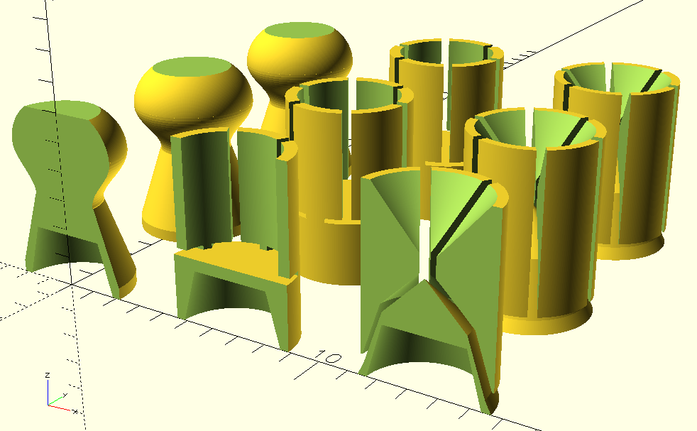

# Parametric airgun pellet script in OpenSCAD

currently supports basic pellets, 'shotshells' (pack with moistened sand or DE to blast flying insects) and flechettes. Printing with extra fine 0.2mm nozzle recommended if your printer can handle detail down to that level. 0.4 can work but getting the tolerances right for parts to break away can be challenging.

might add sabot, bb tipped, and/or rifled shells for smoothbore airguns later.
